# Westminster Tweet Analysis

An analysis of Twitter habits of British MPs.

The analysis looked at over 2.7 million tweets scraped from MP's public Twitter profiles.

## Introduction

This repository contains an analysis of the how current British MPs use Twitter. The analysis is split into several sections:

### General Analysis

Ask questions like:

* Which MP's have the most followers?

* What time do MP's tweet? Does this affect how many interactions they get?

* Which parties are most popular on Twitter?

* How has the Twitter behaviour of MPs changed over time?

* Which MPs follow which other MPs?

### Natural Language Processing

* How does the language used differ between the political parties?

* How does tweet setiment change over time? Which MPs or parties are the most positive or negative?

## Datasets

Several datasets were compiled for this project. They were compiled December 2017.

1. A Tweet dataset. This dataset was built by scraping all the tweets from MPs with Twitter accounts. It is possible some MPs were missed.

2. A Twitter profile dataset. A dataset containing the profile information from MPs e.g. follower count, bio.

3. A Following dataset. All the other Twitter users that an MP follows.

## Methods

See the Jupyter notebooks for the code.

## Results

These are some of the figures. Please look through the Jupyter notebooks for more analysis e.g. the most retweeted tweets, most negative MPs.

### Analysis of Profiles

These results come from the data from scraping the MP's Twitter profiles.

#### Who has the most followers?

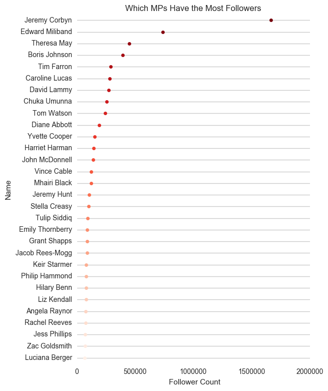

Figure 1. Shows the MPs with the most followers.

#### Who tweets the most?

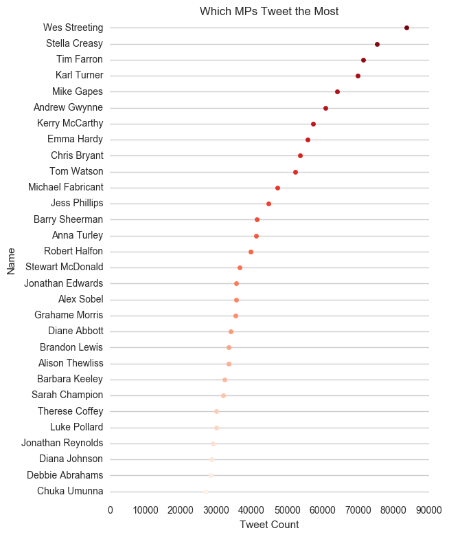

Figure 2. The MPs who have posted the most Tweets.

#### Which parties have the most followers?

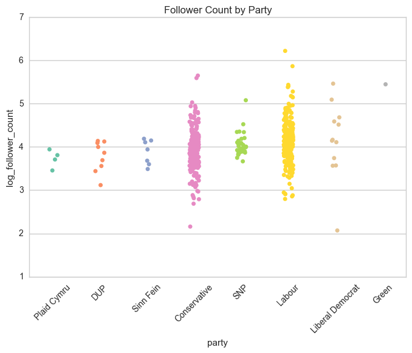

Figure 3. The amount of followers each MP in each party has.

#### Who joined Twitter first?

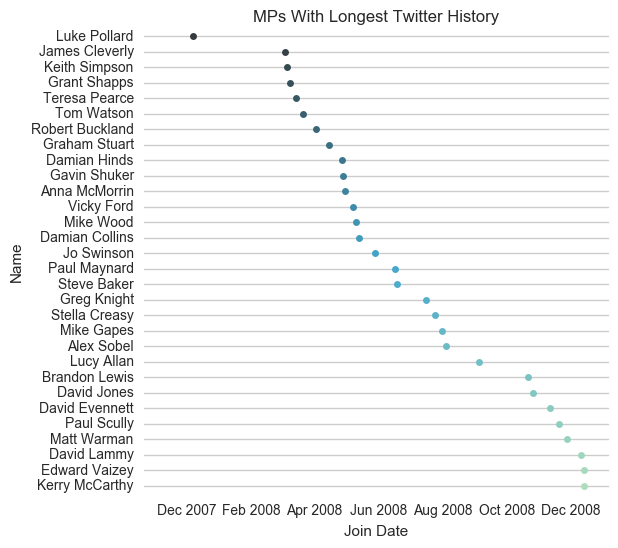

Figure 4. Which MPs have been on twitter the longest?

### Analysis of Tweets

This section shows the analysis of the actual tweets.

#### Proportion of Top 100 Most (retweeted/replied to/favourited) per party

Of the top 100 most replied to tweets what proportion does each party get?

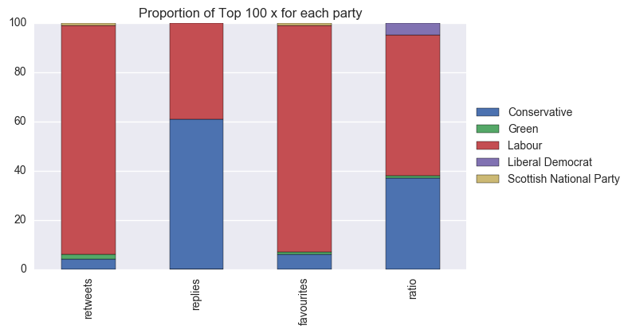

Figure 5. The proportion of the top 100 x per party.

#### Mean Retweets per Party

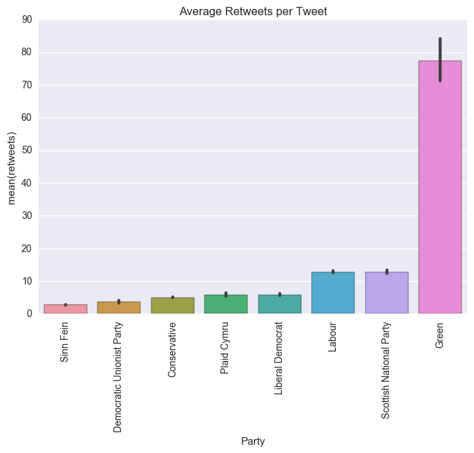

Figure 6. The mean number of retweets each party's MPs get.

#### Mean Replies per Party

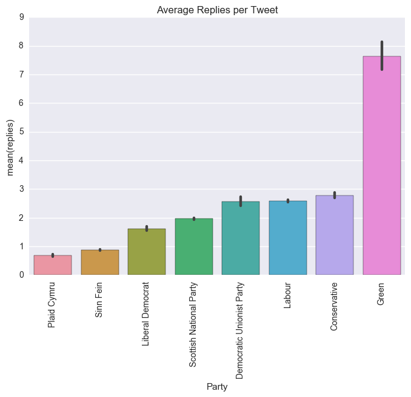

Figure 7. The mean number of replies each party's MPs get.

#### Worst Ratio Per Party

The ratio of replies to retweets/favourites is a resonable metric to how disliked a tweet is. See http://www.esquire.com/news-politics/news/a54440/twitter-ratio-reply/

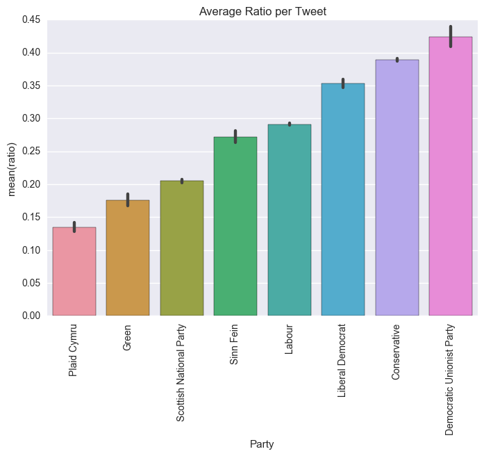

Figure 8. The mean replies to retweets/favourites ratio each party's MPs get.

#### What time do MPs Tweet?

Figure 9 shows the mean number of retweets each tweet is likely to get on each day at each hour. As we are using the mean outliers tend to throw this out a little. See the increase on Wednesday afternoons (PMQs) and Friday mornings (Election results announced).

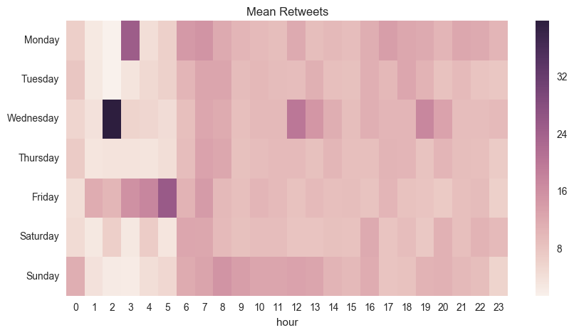

Figure 9. A heatmap showing the mean number of retweets on each day of the week and at each hour.

Figure 10 shows a heatmap of the total tweet count on each weekday and at each hour.

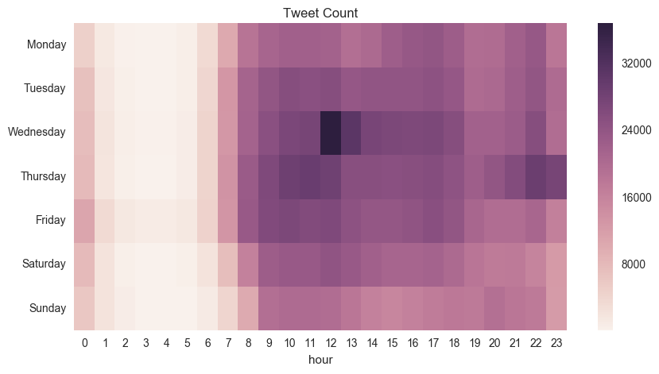

Figure 10. Heatmap of the total number of tweets at each hour over the week.

#### Tweet Volume Over Time

The spikes in tweeting frequency around the 2015 and 2017 elections are clearly visible as is the 2016 Brexit referendum. Note that the Conservative party's tweet frequency does not increase as much as usual in the 2017 election. What caused this change in social media strategy?

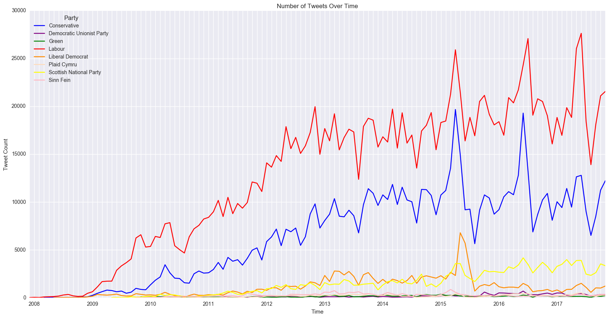

Figure 11. How has the volume of tweets changed over time?

### Sentiment Analysis

After training a naive Bayes classifier each tweet was classified as either positive or negative setiment and the results analysed.

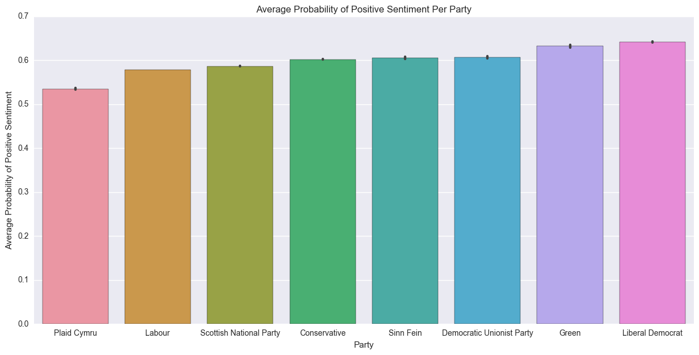

Figure 12. Positivity over time. Lib Dems most positive tweeters.

#### Sentiment Over Time

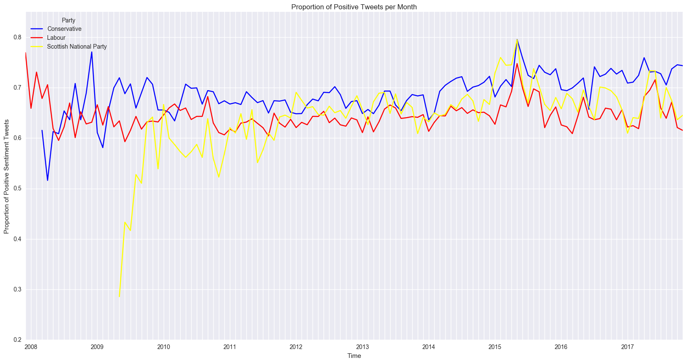

Figure 13. How has sentiment changed over time?

## Further Work and Limitations

* Analysis of who follows who (Create a  mathematical graph).

* See if we can create one of those bots which mimics a particular party.

* Improve results write up.

* Make dataset public.
